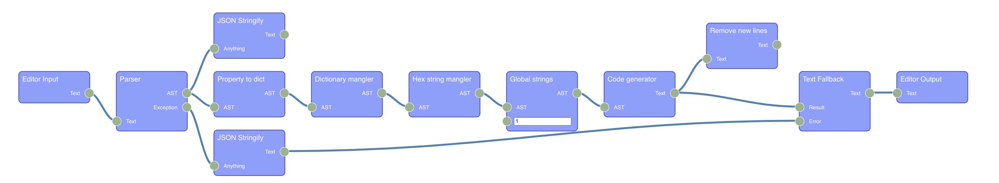
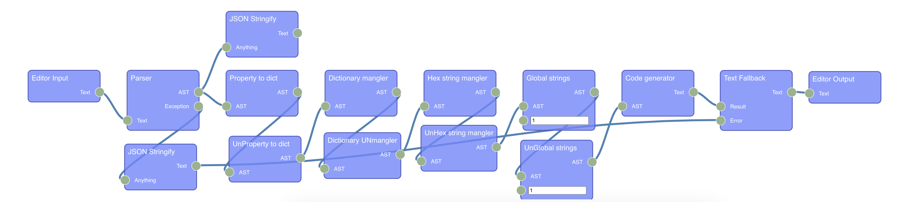

# Raport 13

16.01.2023 11:15

Bartłomiej Chmiel i Piotr Krzystanek

## Finalna wersja



Kod przed obfuskacją:

```javascript

  /*
https://github.com/trekhleb/javascript-algorithms
*/

// Create alphabet array: ['a', 'b', 'c', ..., 'z'].
const englishAlphabet = "abcdefghijklmnopqrstuvwxyz".split("");

/**
 * Generates a cipher map out of the alphabet.
 * Example with a shift 3: {'a': 'd', 'b': 'e', 'c': 'f', ...}
 *
 * @param {string[]} alphabet - i.e. ['a', 'b', 'c', ... , 'z']
 * @param {number} shift - i.e. 3
 * @return {Object} - i.e. {'a': 'd', 'b': 'e', 'c': 'f', ..., 'z': 'c'}
 */
const getCipherMap = (alphabet, shift) => {
  return alphabet.reduce((charsMap, currentChar, charIndex) => {
    const charsMapClone = { ...charsMap };
    // Making the shift to be cyclic (i.e. with a shift of 1 - 'z' would be mapped to 'a').
    let encryptedCharIndex = (charIndex + shift) % alphabet.length;
    // Support negative shifts for creating a map for decryption
    // (i.e. with shift -1 - 'a' would be mapped to 'z').
    if (encryptedCharIndex < 0) {
      encryptedCharIndex += alphabet.length;
    }
    charsMapClone[currentChar] = alphabet[encryptedCharIndex];
    return charsMapClone;
  }, {});
};

/**
 * @param {string} str
 * @param {number} shift
 * @param {string[]} alphabet
 * @return {string}
 */
const caesarCipherEncrypt = (str, shift, alphabet = englishAlphabet) => {
  // Create a cipher map:
  const cipherMap = getCipherMap(alphabet, shift);
  return str
    .toLowerCase()
    .split("")
    .map((char) => cipherMap[char] || char)
    .join("");
};

/**
 * @param {string} str
 * @param {number} shift
 * @param {string[]} alphabet
 * @return {string}
 */
const caesarCipherDecrypt = (str, shift, alphabet = englishAlphabet) => {
  // Create a cipher map:
  const cipherMap = getCipherMap(alphabet, -shift);
  return str
    .toLowerCase()
    .split("")
    .map((char) => cipherMap[char] || char)
    .join("");
};

const sampleText =
  "Lorem Ipsum is simply dummy text of the printing and typesetting industry. Lorem Ipsum has been the industry's standard dummy text ever since the 1500s, when an unknown printer took a galley of type and scrambled it to make a type specimen book. It has survived not only five centuries, but also the leap into electronic typesetting, remaining essentially unchanged. It was popularised in the 1960s with the release of Letraset sheets containing Lorem Ipsum passages, and more recently with desktop publishing software like Aldus PageMaker including versions of Lorem Ipsum";

const SHIFT = 5;

caesarCipherDecrypt(
  caesarCipherEncrypt(sampleText, SHIFT),
  SHIFT
).toLowerCase() === sampleText.toLowerCase();
```

Kod po obfuskacji:

```javascript
let tRMvkjoheplmEeo = {
  "EjyqnmGQUWaESLB": "0",
  "UbUeXDCvbcMeOMQ": "5",
  "MAwYlorSWVRsWIi": "\x61\x62\x63\x64\x65\x66\x67\x68\x69\x6a\x6b\x6c\x6d\x6e\x6f\x70\x71\x72\x73\x74\x75\x76\x77\x78\x79\x7a",
  "HVaBrKBiAEehQQA": "\x73\x70\x6c\x69\x74",
  "aTdMLUNgcNdqbYx": "",
  "wKaMYdXaAtLqRFk": "\x72\x65\x64\x75\x63\x65",
  "NOfJvBDYcZVatza": "\x6c\x65\x6e\x67\x74\x68",
  "coYgzpSdfhkeySF": "\x63\x75\x72\x72\x65\x6e\x74\x43\x68\x61\x72",
  "MWgRdwzntGZWGMd": "\x65\x6e\x63\x72\x79\x70\x74\x65\x64\x43\x68\x61\x72\x49\x6e\x64\x65\x78",
  "wxCjVfoQOClUwhS": "\x74\x6f\x4c\x6f\x77\x65\x72\x43\x61\x73\x65",
  "vXTSdSiCOZG_szf": "\x6d\x61\x70",
  "g_rvXUehl_Mvipe": "\x63\x68\x61\x72",
  "amGLAyADjfRfsrl": "\x6a\x6f\x69\x6e",
  "zLCJTsEBnMTRptn": "\x4c\x6f\x72\x65\x6d\x20\x49\x70\x73\x75\x6d\x20\x69\x73\x20\x73\x69\x6d\x70\x6c\x79\x20\x64\x75\x6d\x6d\x79\x20\x74\x65\x78\x74\x20\x6f\x66\x20\x74\x68\x65\x20\x70\x72\x69\x6e\x74\x69\x6e\x67\x20\x61\x6e\x64\x20\x74\x79\x70\x65\x73\x65\x74\x74\x69\x6e\x67\x20\x69\x6e\x64\x75\x73\x74\x72\x79\x2e\x20\x4c\x6f\x72\x65\x6d\x20\x49\x70\x73\x75\x6d\x20\x68\x61\x73\x20\x62\x65\x65\x6e\x20\x74\x68\x65\x20\x69\x6e\x64\x75\x73\x74\x72\x79\x27\x73\x20\x73\x74\x61\x6e\x64\x61\x72\x64\x20\x64\x75\x6d\x6d\x79\x20\x74\x65\x78\x74\x20\x65\x76\x65\x72\x20\x73\x69\x6e\x63\x65\x20\x74\x68\x65\x20\x31\x35\x30\x30\x73\x2c\x20\x77\x68\x65\x6e\x20\x61\x6e\x20\x75\x6e\x6b\x6e\x6f\x77\x6e\x20\x70\x72\x69\x6e\x74\x65\x72\x20\x74\x6f\x6f\x6b\x20\x61\x20\x67\x61\x6c\x6c\x65\x79\x20\x6f\x66\x20\x74\x79\x70\x65\x20\x61\x6e\x64\x20\x73\x63\x72\x61\x6d\x62\x6c\x65\x64\x20\x69\x74\x20\x74\x6f\x20\x6d\x61\x6b\x65\x20\x61\x20\x74\x79\x70\x65\x20\x73\x70\x65\x63\x69\x6d\x65\x6e\x20\x62\x6f\x6f\x6b\x2e\x20\x49\x74\x20\x68\x61\x73\x20\x73\x75\x72\x76\x69\x76\x65\x64\x20\x6e\x6f\x74\x20\x6f\x6e\x6c\x79\x20\x66\x69\x76\x65\x20\x63\x65\x6e\x74\x75\x72\x69\x65\x73\x2c\x20\x62\x75\x74\x20\x61\x6c\x73\x6f\x20\x74\x68\x65\x20\x6c\x65\x61\x70\x20\x69\x6e\x74\x6f\x20\x65\x6c\x65\x63\x74\x72\x6f\x6e\x69\x63\x20\x74\x79\x70\x65\x73\x65\x74\x74\x69\x6e\x67\x2c\x20\x72\x65\x6d\x61\x69\x6e\x69\x6e\x67\x20\x65\x73\x73\x65\x6e\x74\x69\x61\x6c\x6c\x79\x20\x75\x6e\x63\x68\x61\x6e\x67\x65\x64\x2e\x20\x49\x74\x20\x77\x61\x73\x20\x70\x6f\x70\x75\x6c\x61\x72\x69\x73\x65\x64\x20\x69\x6e\x20\x74\x68\x65\x20\x31\x39\x36\x30\x73\x20\x77\x69\x74\x68\x20\x74\x68\x65\x20\x72\x65\x6c\x65\x61\x73\x65\x20\x6f\x66\x20\x4c\x65\x74\x72\x61\x73\x65\x74\x20\x73\x68\x65\x65\x74\x73\x20\x63\x6f\x6e\x74\x61\x69\x6e\x69\x6e\x67\x20\x4c\x6f\x72\x65\x6d\x20\x49\x70\x73\x75\x6d\x20\x70\x61\x73\x73\x61\x67\x65\x73\x2c\x20\x61\x6e\x64\x20\x6d\x6f\x72\x65\x20\x72\x65\x63\x65\x6e\x74\x6c\x79\x20\x77\x69\x74\x68\x20\x64\x65\x73\x6b\x74\x6f\x70\x20\x70\x75\x62\x6c\x69\x73\x68\x69\x6e\x67\x20\x73\x6f\x66\x74\x77\x61\x72\x65\x20\x6c\x69\x6b\x65\x20\x41\x6c\x64\x75\x73\x20\x50\x61\x67\x65\x4d\x61\x6b\x65\x72\x20\x69\x6e\x63\x6c\x75\x64\x69\x6e\x67\x20\x76\x65\x72\x73\x69\x6f\x6e\x73\x20\x6f\x66\x20\x4c\x6f\x72\x65\x6d\x20\x49\x70\x73\x75\x6d"
};
let vars = {};
 vars["LTTqjXLMPefvuSG"] = tRMvkjoheplmEeo["MAwYlorSWVRsWIi"][tRMvkjoheplmEeo["LSlUumBL_DOFZNE"]](tRMvkjoheplmEeo["TcSuujAoN_cJsTv"]);
 vars["yxlA_vhBafgkXRd"] = (alphabet, shift) => {
  return alphabet[tRMvkjoheplmEeo["wKaMYdXaAtLqRFk"]]((charsMap, currentChar, charIndex) => {
     vars["mDJelhwIWVFItYX"] = {
      ...charsMap
    };
     vars["DwAICSNxpwkkoUq"] = (charIndex + shift) % alphabet[tRMvkjoheplmEeo["HZeKUMARpIOAcan"]];
    if (vars["DwAICSNxpwkkoUq"] < tRMvkjoheplmEeo["EjyqnmGQUWaESLB"]) {
      vars["DwAICSNxpwkkoUq"] += alphabet[tRMvkjoheplmEeo["NOfJvBDYcZVatza"]];
    }
    vars["mDJelhwIWVFItYX"][tRMvkjoheplmEeo["coYgzpSdfhkeySF"]] = alphabet[tRMvkjoheplmEeo["MWgRdwzntGZWGMd"]];
    return vars["mDJelhwIWVFItYX"];
  }, {});
  ```

  

  Kod po deobfuskacji:

  ```javascript
let callexpression1 = ("abcdefghijklmnopqrstuvwxyz").split(undefined);
let arrowfunctionexpression1 = (alphabet, shift) => {
  return alphabet.reduce((charsMap, currentChar, charIndex) => {
    let objectexpression1 = {
      ...charsMap
    };
    let binaryexpression1 = (charIndex + shift) % alphabet.length;
    if (binaryexpression1 < "0") {
      binaryexpression1 += alphabet.length;
    }
    objectexpression1.currentChar = alphabet.encryptedCharIndex;
    return objectexpression1;
  }, {});
};
let arrowfunctionexpression2 = (str, shift, alphabet = callexpression1) => {
  let callexpression2 = arrowfunctionexpression1(alphabet, shift);
  return str.toLowerCase().split(undefined).map(char => callexpression2.char || char).join(undefined);
};
let arrowfunctionexpression3 = (str, shift, alphabet = callexpression1) => {
  let callexpression3 = arrowfunctionexpression1(alphabet, -shift);
  return str.toLowerCase().split(undefined).map(char => callexpression3.char || char).join("");
};
let literal1 = "Lorem Ipsum is simply dummy text of the printing and typesetting industry. Lorem Ipsum has been the industry's standard dummy text ever since the 1500s, when an unknown printer took a galley of type and scrambled it to make a type specimen book. It has survived not only five centuries, but also the leap into electronic typesetting, remaining essentially unchanged. It was popularised in the 1960s with the release of Letraset sheets containing Lorem Ipsum passages, and more recently with desktop publishing software like Aldus PageMaker including versions of Lorem Ipsum";
let literal2 = "5";
arrowfunctionexpression3(arrowfunctionexpression2(literal1, literal2), literal2).toLowerCase() === literal1.toLowerCase();
  ```

## Podsumowanie

Podczas realizacji projektu poznaliśmy wiele technik ukrywania logiki kodu ale też metod na odwracanie tego procesu.
Zauważyliśmy, że część danych jest tracona bezpowrotnie w procesie ukrywania co pozwoliło nam lepiej zrozumieć ile tak naprawdę danych zawartych w programach komputerowych jest potrzebnych tylko dla ludzi a ile wystarczy aby kod się uruchomił i zadziałał.