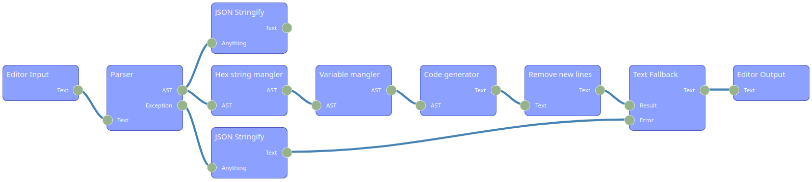

# Raport 6

14.11.2022 11:15

Bartłomiej Chmiel i Piotr Krzystanek

## Zakres zmian

Na zajęcia 6 przygotowaliśmy przekształcenia kodu,
przykładowy ciąg przekształceń oraz dodaliśmy testy automatyczne.

## Przekształcenie 1 - Dictionary mangler

To przekształcenie składa się z następujących etapów:

1. Usuwanie słów kluczowych `let`, `var`, `const`. Dzięki temu
   przekształcony kod traci informację, które zmienne były mutowalne, a
   jednocześnie nie zmienia działania programu.

2. Tworzenie globalnego słownika zmiennych.

3. Zmienianie każdej zmiennej na wartość zmiennej ze słownika. Dzięki
   temu przekształceniu, tracimy informację na temat nazw zmiennych oraz
   ich zasięgu, a nie zmieniamy działania programu. Dodatkowo podczas procesu
   deobfuskacji, intellisense i inne usługi podpowiadania kodu, będą nieskuteczne,
   ponieważ wcześniej utworzony globalny słownik zawierający wszystkie zmienne,
   jest deklarowany na początku jako pusty, a podczas biegu programu, na bierząco
   rozszerzany o nowe wartości i klucze.

Kod przed przekształceniem:

```js
const englishAlphabet = "abcdefghijklmnopqrstuvwxyz".split("");
```

Kod po przekształceniu:

```js
let vars = {};
vars["hnsZdPalsTcXblK"] = "abcdefghijklmnopqrstuvwxyz".split("");
```

## Przekształcenie 2 - Hexadecimal string mangling

W języku JavaScript, ciągi znaków można zapisywać w dwóch postaciach:

- UTF-8 unicode
- kodowanie szesnastkowe

Kodowanie szesnastkowe jest automatycznie przekształcane na UTF-8, dzięki
czemu nie zmienia działania programu.

Wszystkie ciągi znaków zawierają cenne informacje dotyczące przeznaczenia
programu. W celu ukrycia tej informacji przed człowiekiem czytającym kod,
zaimplementowaliśmy przekształcenie kodujące wszystkie znaki w systemie
szesnastkowym.

Kod przed przekształceniem:

```js
const englishAlphabet = "abcdefghijklmnopqrstuvwxyz".split("");
```

Kod po przekształceniu:

```js
const englishAlphabet =
  "\x61\x62\x63\x64\x65\x66\x67\x68\x69\x6a\x6b\x6c\x6d\x6e\x6f\x70\x71\x72\x73\x74\x75\x76\x77\x78\x79\x7a".split(
    ""
  );
```

## Przekształcenie 3 - Oneline transformer

W celu zaciemnienia struktury kodu, używamy przekształcenia
usuwającego wszystkie znaki nowej lini '\n' z programu.
Dzięki temu przekształceniu kod będzie znacznie trudniejszy do
przeglądania dla człowieka. Niestety to przekształcenie można łatwo
odwrócić używając formatera kodu np. Prettier.

Kod przed przekształceniem:

```js
function foo() {
  console.log("bar");
  return 0;
}
console.log("baz");
```

Kod po przekształceniu:

```js
function foo() {
  console.log("bar");
  return 0;
}
console.log("baz");
```

## Przykładowy ciąg przekształceń

Dla powyższych przekształceń zaimplementowaliśmy następujący
ciąg obfuskacji:



## Testy automatyczne

Dla przekształceń powyżej przygotowaliśmy testy jednostkowe
sprawdzające czy obfuskacja nie ma wpływu na działanie programu.
Podczas testów obfuskowaliśmy kod dostępny w repozytorium:
https://github.com/trekhleb/javascript-algorithms
